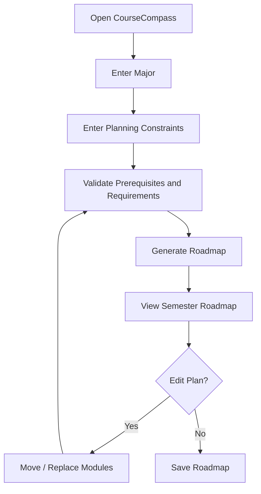
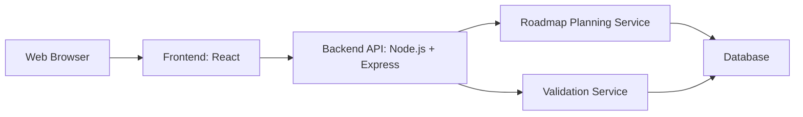
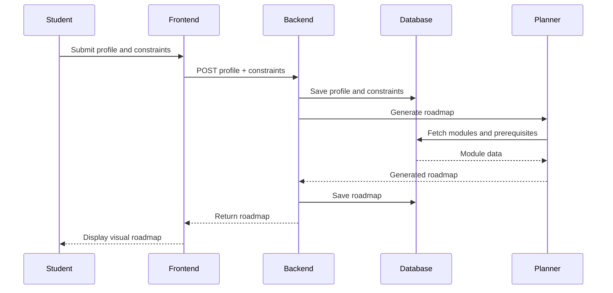
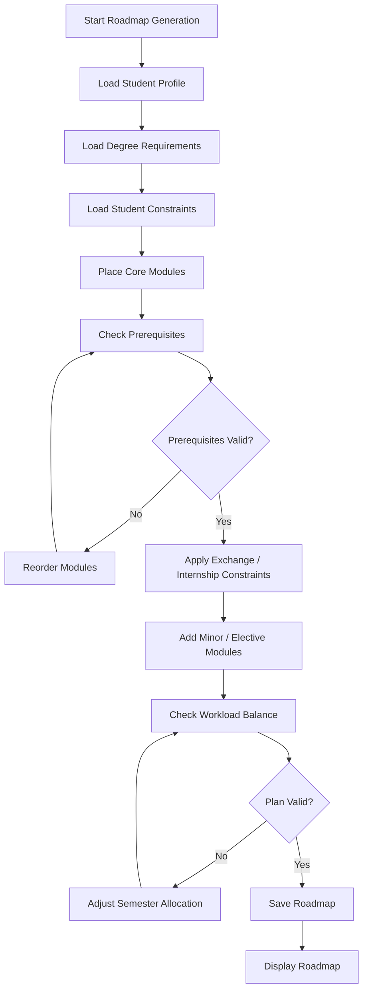
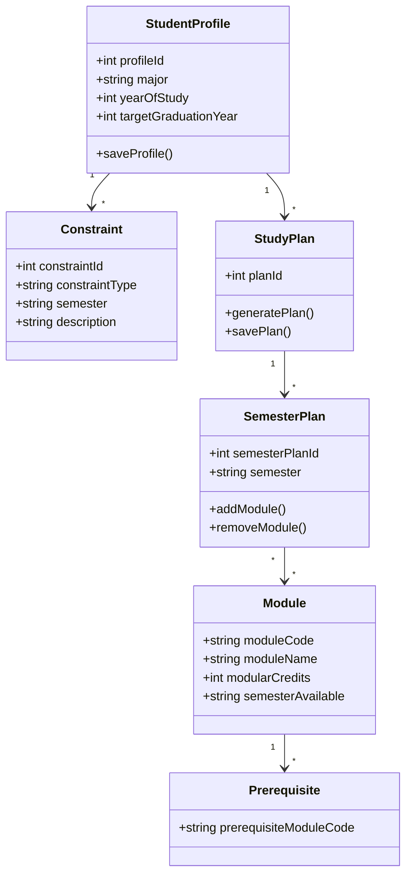

# CourseCompass

CourseCompass is a personalised module planning web application for NUS students.

It helps students generate a flexible semester-by-semester study roadmap based on:

- Major requirements
- Exchange plans
- Internship periods
- Minors or second majors
- Elective interests
- Prerequisite and graduation requirements

## Project Structure

```text
CourseCompass/
├── frontend/
└── backend/
└── database/
```

## Setup Guide

### Prerequisites

Before running CourseCompass, ensure the following are installed:

* Node.js (v18+ recommended)
* npm
* PostgreSQL
* Git

Verify installation:

```bash
node -v
npm -v
psql --version
```

---

### 1. Clone the Repository

```bash
git clone [<repository-url>](https://github.com/jiajun-19/CourseCompass.git)
cd CourseCompass
```

---

### 2. Install Backend Dependencies

```bash
cd backend
npm install
```

This installs:

* Express
* PostgreSQL Driver (pg)
* CORS
* dotenv

---

### 3. Install Frontend Dependencies

```bash
cd ../frontend
npm install
npm install react react-dom
```

---

### 4. Create the Database

Create a PostgreSQL database:

```bash
createdb coursecompass
```

If `createdb` does not work, open PostgreSQL manually and run:

```sql
CREATE DATABASE coursecompass;
```

---

### 5. Load Database Schema

From the project root:

```bash
psql -d coursecompass -f database/schema.sql
```

This creates all required tables.

---

### 6. Seed the Database

```bash
psql -d coursecompass -f database/seed.sql
```

This inserts sample data including student profiles and modules.

---

### 7. Configure Backend Environment Variables

Create:

```text
backend/.env
```

Example:

```env
PORT=3000
DATABASE_URL=postgresql://YOUR_USERNAME@localhost:5432/coursecompass
```

Replace:

```text
YOUR_USERNAME
```

with your PostgreSQL username.

Example:

```env
DATABASE_URL=postgresql://jiajun@localhost:5432/coursecompass
```

---

### 8. Start Backend

```bash
cd backend
npm run dev
```

Expected output:

```text
Server running on port 3000
```

---

### 9. Verify Backend Connection

Visit:

```text
http://localhost:3000/db-test
```

Expected response:

```json
{
  "now": "2026-..."
}
```

This confirms:

* Express is running
* PostgreSQL is running
* Database connection is successful

---

### 10. Start Frontend

Open a new terminal:

```bash
cd frontend
npm run dev
```

Expected output:

```text
Local: http://localhost:5173/
```

---

### 11. Open the Application

Visit:

```text
http://localhost:5173
```

You should see:

* Student profile dropdown
* Generated roadmap display

---

## System Design

### 1. System Overview

CourseCompass is a personalised module planning web application for NUS students. The system helps students generate a 3-4 year study roadmap by considering their major requirements, prerequisites, exchange plans, internships, minors, second majors, specialisations, and elective interests.

The system is designed as a web application with a frontend, backend API, and database. The frontend provides the user interface, the backend handles authentication and planning logic, and the database stores modules, prerequisites, constraints, and generated study plans.

### 2. Features

#### Feature List

##### Core Features

- Study Plan Generator
Generates a personalised semester-by-semester academic roadmap based on the student's selected degree programme. The system organises modules across all semesters while ensuring a structured progression towards graduation. 
- Custom Constraints
Allows students to incorporate personal academic goals and constraints into their study plan. Examples include exchange programmes, internship semesters, lighter workload preferences, or other scheduling considerations. The generated roadmap adapts accordingly to accommodate these requirements.
- Requirement Checking
Automatically validates generated study plans against prerequisite chains and graduation requirements. This helps ensure that students complete modules in a valid order and remain on track to fulfil programme requirements.

##### Extension Features

- Minor / second major planner
Supports students who wish to pursue a minor or second major alongside their primary degree. The planner integrates additional module requirements into the roadmap while balancing workload and graduation timelines.
- Module Recommendations
Provides elective module suggestions based on the student's academic interests and chosen programme. This helps students discover relevant modules that align with their goals while satisfying elective requirements.
- Visual roadmap display
Presents the generated study plan in an intuitive semester-by-semester visual roadmap. Students can easily view their academic journey from Year 1 Semester 1 through Year 4 Semester 2, improving clarity and long-term planning.

### 3. User Flow

The main user flow should be simple and guided:

1. Student enters academic goals and constraints.
2. System validates prerequisites and requirements.
3. System generates study roadmap.
4. Student views and edits study roadmap.
5. Student saves final roadmap.




### 4. System Architecture

#### High-Level Architecture

CourseCompass should use a three-layer architecture:

1. Frontend Layer
  - Handles user interface and user interactions.
  - Built with React.
2. Backend Layer
  - Handles business logic, roadmap generation, and validation.
  - Built with Node.js and Express.
3. Database Layer
  - Stores modules, prerequisites, constraints, and study plans.
  - Uses postgreSQL




#### Frontend Responsibilities

- Display login pages.
- Collect planning constraints.
- Display generated roadmap.
- Show warnings and validation results.

#### Backend Responsibilities

- Store module data.
- Generate roadmap.
- Validate prerequisites.
- Validate graduation requirements.
- Save user roadmap.

#### Database Responsibilities

- Store persistent data.
- Maintain relationships between profiles, modules, constraints, and plans.
- Support roadmap retrieval and validation.

### 5. Sequence Diagram

This sequence diagram shows the login and roadmap generation flow.




### 6. Activity Diagram

This activity diagram shows the roadmap generation process.




### 7. Class Diagram

This class diagram shows the main objects in the system.




### 8. ER Diagram

This ER diagram shows the proposed database structure.

```mermaid
erDiagram
    STUDENT_PROFILES ||--o{ CONSTRAINTS           : "sets"
    STUDENT_PROFILES ||--o{ STUDY_PLANS           : "owns"
    STUDY_PLANS      ||--o{ SEMESTER_PLANS        : "consists of"
    SEMESTER_PLANS   ||--o{ SEMESTER_PLAN_MODULES : "has"
    MODULES          ||--o{ SEMESTER_PLAN_MODULES : "is placed in"
    MODULES          ||--o{ PREREQUISITES         : "may have"

    STUDENT_PROFILES {
        int profile_id PK
        string major
        int year_of_study
        int target_graduation_year
    }

    MODULES {
        string module_code PK
        string module_name 
        int modular_credits
        string faculty
        string semester_available
    }

    PREREQUISITES {
        int prerequisite_id PK
        string module_code FK
        string prerequisite_module_code FK
    }

    CONSTRAINTS {
        int constraint_id PK
        int profile_id FK
        string constraint_type
        string semester
        string description
    }

    STUDY_PLANS {
        int plan_id PK
        int profile_id FK
        string plan_name
        datetime created_at
    }

    SEMESTER_PLANS {
        int semesterPlanId PK
        int plan_id FK
    }

    SEMESTER_PLAN_MODULES {
        int semester_plan_module_id PK
        int semesterPlanId FK
        string module_code FK
    }
```




### 9. Design Principles

#### 1. Separation of Concerns

The frontend, backend, and database should each have clear responsibilities. The frontend should focus on display and user interaction, while the backend handles planning logic and validation.

#### 2. Modularity

The system should be split into modules such as profile management, roadmap generation, prerequisite checking, and recommendation logic. This makes the system easier to test and extend.

#### 3. Simplicity First

The first prototype should use a simple rule-based roadmap generator instead of a complex optimisation algorithm. This reduces risk and makes Milestone 1 and Milestone 2 achievable.

#### 4. User-Centric Design

The system should present study plans in a way that is easy for students to understand. Warnings should be clear, and the roadmap should be visual instead of text-heavy.

#### 5. Data Integrity

Prerequisites, graduation requirements, and module constraints should be validated on the backend to avoid invalid plans.

#### 6. Extensibility

The system should be designed so future features such as module recommendations, specialisation planning, and PDF export can be added without rewriting the entire application.

### 10. Design Patterns

#### Model-View-Controller Style Separation

CourseCompass can use an MVC-inspired structure:

- Model: database entities such as User, Module, StudyPlan, and Constraint
- View: React frontend pages and components
- Controller: Express route handlers

This keeps frontend display separate from backend logic and database models.

#### Service Layer Pattern

Backend logic should be placed in services:

- ProfileService
- RoadmapService
- ValidationService
- RecommendationService

This prevents route handlers from becoming too large and makes the logic easier to test.

#### Repository Pattern

Database access can be grouped into repositories:

- ProfileRepository
- ModuleRepository
- StudyPlanRepository
- ConstraintRepository

This keeps SQL queries separate from business logic.

#### Rule-Based Planner

For the first version, roadmap generation should use simple rules:

- Place required core modules first.
- Ensure prerequisites appear before dependent modules.
- Avoid placing modules in exchange semesters where appropriate.
- Reduce workload during internship semesters.
- Fill remaining slots with electives.

This is easier to explain, test, and improve later.

### 11. Design Decisions

#### Decision 1: Web Application vs Mobile Application


| Option             | Pros                                                                              | Cons                                                      |
| ------------------ | --------------------------------------------------------------------------------- | --------------------------------------------------------- |
| Web application    | Easier to build, accessible on laptops, suitable for planning tables and roadmaps | Less mobile-native                                        |
| Mobile application | Convenient on phone, app-like experience                                          | More development effort, harder to display large roadmaps |


Decision: Build a web application.

Justification: Course planning is easier on a larger screen because students need to compare semesters, modules, requirements, and constraints. A web app is also faster to build for the project timeline.

#### Decision 2: React vs Plain HTML/CSS/JavaScript


| Option                    | Pros                                                                 | Cons                                |
| ------------------------- | -------------------------------------------------------------------- | ----------------------------------- |
| React                     | Component-based, easier to build interactive roadmap UI, widely used | Requires setup and learning         |
| Plain HTML/CSS/JavaScript | Simple for small pages                                               | Harder to maintain as features grow |


Decision: Use React.

Justification: CourseCompass needs reusable components such as module cards, semester grids, forms, and roadmap views. React is better suited for this than plain HTML/CSS/JavaScript.

#### Decision 3: Node.js/Express vs Python Flask


| Option          | Pros                                                       | Cons                                    |
| --------------- | ---------------------------------------------------------- | --------------------------------------- |
| Node.js/Express | Same language as frontend, good for REST APIs, lightweight | Requires careful structure as app grows |
| Python Flask    | Simple backend framework, good for quick APIs              | Different language from frontend        |


Decision: Use Node.js and Express.

Justification: Using JavaScript for both frontend and backend makes development simpler for a small team and allows faster integration.

#### Decision 4: SQLite vs PostgreSQL


| Option     | Pros                                                               | Cons                                              |
| ---------- | ------------------------------------------------------------------ | ------------------------------------------------- |
| SQLite     | Easy setup, no external database server, good for proof of concept | Less suitable for production and multi-user scale |
| PostgreSQL | More scalable and production-ready                                 | More setup effort                                 |


Decision: Use PostgreSQL

Justification: PostgreSQL was chosen to ensure production-readiness from day one. It natively supports the advanced data types and recursive queries necessary for handling complex course prerequisites and dynamic student constraints.

#### Decision 5: Rule-Based Planner vs Optimisation Algorithm


| Option                 | Pros                                        | Cons                                             |
| ---------------------- | ------------------------------------------- | ------------------------------------------------ |
| Rule-based planner     | Easy to implement, explain, test, and debug | May not always produce the most optimal plan     |
| Optimisation algorithm | Can generate more optimal plans             | Harder to implement and test within the timeline |


Decision: Start with a rule-based planner.

Justification: The project timeline is limited. A rule-based planner is realistic and can still satisfy the main user need of generating a clear roadmap.

### 12. Recommended Milestone 1 Design Scope

For Milestone 1, CourseCompass will focus on a **Relational Architecture Proof of Concept** by deferring user management and the rule-based planner engine. The objective is to establish and validate the end-to-end data pipeline.

**Milestone 1 Core Focus:**

- **Pre-seeded Database:** Establish core PostgreSQL tables populated with sample student profiles, modules, and pre-mapped academic pathways.
- **Dashboard Display:** A React interface that fetches and displays a mock Y1S1 to Y4S2 roadmap dynamically tied to a selected target profile.
- **State Modification:** A basic interactive feature (e.g., adding/removing a module) that successfully updates the state in the database and reflects on the UI.

**This explicitly proves that:**

1. The React frontend cleanly renders data structures returned by the server.
2. The backend effectively handles routing, requests, and database connectivity.
3. The PostgreSQL database correctly processes relational queries and mutations.
4. The entire core system is integrated and ready for the implementation of the Rule-Based Planner in Milestone 2.

---

## Development Plan

### Milestone 1: Ideation and Technical Proof of Concept

**Deadline:** 1 June 2026, before 2pm SGT

#### Goal
Build a technical proof of concept showing that the frontend and backend can work together to generate and display a basic study plan.

#### Tasks

**Project Setup**
- Create GitHub repository.
- Set up React frontend.
- Set up Node/Express backend.
- Add README outline.
- Add project log.
- Add GitHub issues for all major features.
- Confirm tech stack:
  - React
  - Node.js / Express
  - PostgreSQL or seed JSON data
  - GitHub
  - Deployment platform

**System Design**
- Design frontend page for programme input.
- Design backend endpoint for generating a study plan.
- Create simple data model for modules and semesters.
- Create architecture diagram.

**Technical Proof of Concept**
- Allow user to select one supported programme, such as Business Analytics.
- Send selected programme from frontend to backend.
- Return a hardcoded or rule-based semester plan from backend.
- Display generated plan in a semester grid or roadmap.
- Add basic error handling.

#### Submission Deliverables
- README with: motivation, user stories, features, system design, development plan, tech stack, proof of concept explanation.
- Project log showing: who did what, hours spent.
- Updated poster with proof-of-concept screenshot.
- Video showing: project idea, frontend/backend proof-of-concept demo.

#### Success Condition
A user can select a programme and see a generated study plan returned from the backend.

---

### Milestone 2: Core Prototype

**Deadline:** 29 June 2026, before 2pm SGT

#### Goal
Build a usable prototype containing the three core features:
1. Personalised study plan generator
2. Custom constraints input
3. Prerequisite and requirement checking

#### Week 1: Data Foundations — *2 June to 8 June 2026*
- Create module schema.
- Create programme requirement schema.
- Seed data for at least one full degree path.
- Add module fields: module code, title, units, semester availability, prerequisites, requirement category.
- Add backend tests for data loading.

**Goal by 8 June:** Backend can retrieve modules and programme requirements reliably.

#### Week 2: Study Plan Generator — *9 June to 15 June 2026*
- Generate a 3–4 year study plan.
- Respect normal workload per semester.
- Separate: core modules, electives, unrestricted electives.
- Avoid obvious invalid module sequencing.
- Display plan clearly in frontend.

**Goal by 15 June:** Feature 1 is meaningfully working and is no longer just hardcoded.

#### Week 3: Custom Constraints — *16 June to 22 June 2026*
- Add support for exchange semester.
- Add support for internship or lighter workload semester.
- Add support for preferred workload range.
- Add blocked semester if useful.
- Allow users to select constraints from the frontend.

**Goal by 22 June:** Feature 2 works at prototype level.

#### Week 4: Prerequisite and Requirement Checking — *23 June to 28 June 2026*
- Check that prerequisites appear before dependent modules.
- Warn if a plan violates requirements.
- Show missing requirement categories.
- Add basic system tests.

**Goal by 28 June:** Feature 3 works at prototype level.

#### Submission Deliverables
- README updated with: core features developed, problems encountered, system testing evidence, screenshots.
- Poster and video showing prototype.
- Updated project log.

#### Success Condition
CourseCompass can generate a basic valid study plan while considering user constraints and prerequisite/requirement checks.

---

### Milestone 3: Extension Features

**Deadline:** 27 July 2026, before 2pm SGT

#### Goal
Complete all extension features:
- Minor / second major planner
- Module recommendation system
- Visual study roadmap

#### Week 1: Minor / Second Major Planner — *30 June to 6 July 2026*
- Allow user to select a minor or second major.
- Add required modules to the generated plan.
- Detect overloaded or impossible semesters.
- Show warnings when the plan becomes too heavy.

**Goal by 6 July:** Feature 4 works for at least one minor or second major.

#### Week 2: Module Recommendations — *7 July to 13 July 2026*
- Recommend electives based on interest areas.
- Recommend modules that fit available semesters.
- Avoid recommending modules with unmet prerequisites.
- Label recommendations clearly.

**Goal by 13 July:** Feature 5 works at a useful prototype level.

#### Week 3: Visual Roadmap — *14 July to 20 July 2026*
- Build timeline or semester grid.
- Colour-code module categories: core, elective, minor, specialisation, exchange, internship.
- Allow users to inspect module details.
- Make UI presentable and readable.

**Goal by 20 July:** Feature 6 works and visually matches the intended CourseCompass experience.

#### Week 4: Testing and Cleanup — *21 July to 26 July 2026*
- Perform system testing.
- Conduct user testing with classmates.
- Fix confusing user flows.
- Improve README.
- Update poster and video.
- Document known limitations.

**Suggested User Testing Tasks:** Generate a plan · Add exchange semester · Add a minor · Inspect prerequisite warning · Find recommended elective · Understand roadmap without explanation.

#### Submission Deliverables
- README updated with: bugs fixed, extension features developed, user testing, problems encountered.
- Updated project log.
- Poster and video showing complete system.
- User testing results.

#### Success Condition
All six features exist in the app, and users can complete the main CourseCompass planning flow end to end.

---

### Splashdown: Refinement and Final Presentation

**Date:** 26 August 2026

**Goal:** Polish, stabilise, and present the final CourseCompass product.

#### Phase 1: Fix High-Priority Issues — *28 July to 4 August 2026*
- Fix broken study plans.
- Fix prerequisite bugs.
- Improve unclear warnings.
- Resolve overloaded semester issues.
- Fix UI layout problems.
- Handle missing data cases.

#### Phase 2: Improve Product Quality — *5 August to 11 August 2026*
- Improve loading states.
- Add clearer empty states.
- Improve mobile and responsive layout.
- Add export/share plan feature if feasible.
- Improve roadmap visuals.
- Improve module detail display.

#### Phase 3: Final Testing — *12 August to 18 August 2026*
- Perform regression testing.
- Conduct second round of user testing.
- Test deployment.
- Clean up README.
- Complete project log.
- Check that both team members have balanced contributions.

#### Phase 4: Final Presentation Preparation — *19 August to 25 August 2026*
- Prepare final poster, final video, and demo script.
- Prepare backup screenshots and a backup local demo.
- Prepare answers for likely questions.

#### Splashdown Day — *26 August 2026*
- Present final CourseCompass.
- Demo full user journey.
- Explain system design and engineering practices.
- Show testing and user feedback.
- Highlight future improvements.

---

## Milestone 2 — Implementation Report

### 🚀 Core Features Developed

#### 1. Study Plan Generator
We built a rule-based study plan generator that produces a complete semester-by-semester roadmap for a selected major, covering Year 1 Semester 1 through Year 4 Semester 2. The generator:
- Retrieves live module data from the NUSMods API
- Prioritises the major's core modules
- Fills remaining units with appropriate electives and General Education modules
- Distributes modules across all 8 semesters
- Maintains a sensible workload of approximately 20 units per semester by default

#### 2. Requirement Checking
The planner validates each generated study plan against actual graduation requirements instead of simply listing modules.

**✅ Graduation Units** — ensures the plan satisfies the required graduation units:
- 160 units (standard pathway)
- 140 units (polytechnic exemption)

**✅ Prerequisite Validation** — verifies that modules are only taken after all prerequisite modules have been completed, supporting structured prerequisite logic from NUSMods, including **AND** and **OR** requirements.

**✅ Internship Eligibility** — credit-bearing internships are only permitted when students satisfy all eligibility rules:
- At least 70 units completed
- Internship is scheduled between Year 2 Semester 2 and Year 4 Semester 1

#### 3. Custom Constraints
Students can personalise the generated roadmap according to their academic plans.

- **🌏 Exchange Planning** — mark any semester as an exchange semester; the semester is left free of local modules, and exchange units are counted towards graduation.
- **💼 Internship Planning** — schedule one credit-bearing internship (4, 8, 10 or 12 units), placed in an eligible regular semester or a Summer Special Term (e.g. SIP). Internship units contribute towards graduation, and the remaining semesters automatically adjust.
- **➕ Add / Remove Modules** — add any module to a semester or a Special Term, remove modules, and automatically revalidate the plan after every change.
- **🎓 Graduation Requirement Toggle** — switch between the 160-unit requirement and the 140-unit polytechnic exemption; the planner automatically repacks the entire roadmap.
- **⚖️ Workload Balancing** — adjust any semester's workload in 4-unit increments; the planner redistributes remaining modules so graduation requirements remain satisfied and total units are unchanged.

#### 4. Extension Features
- **🗺️ Visual Roadmap** — the plan is presented as a clean semester-by-semester timeline with module cards, internship cards, exchange cards, and a summary of total modules and units. Winter and Summer Special Terms only appear when they contain planned activities.
- **💾 Saved Progress** — the application stores the student's progress in the browser using Local Storage, so users can refresh, return later, and restore the exact generated roadmap instantly.

### ⚠️ Problems Encountered

**1. Prerequisite data did not match real eligibility.**
NUSMods prerequisite data only records module prerequisites and does not include alternative qualifications such as A-Level subjects or bridging qualifications. For example, `MA1521` lists `MA1301` as its prerequisite, but many students satisfy this through A-Level Mathematics instead, causing valid selections to be incorrectly rejected.
**Solution** — We only enforce a prerequisite if that prerequisite module actually exists within the student's plan; requirements assumed to be satisfied before university (such as A-Level Mathematics) are treated as already fulfilled.

**2. Removing modules could break the study plan.**
Unrestricted removal let students remove compulsory core modules or modules required as prerequisites for later modules, producing invalid plans.
**Solution** — Validation now prevents removal when the module is required for graduation or another planned module depends on it; when blocked, the planner explains why and restores the original plan.

**3. Workload rebalancing with non-4-unit modules.**
Not every module is worth 4 units, and 140 units cannot be evenly distributed across 8 semesters, occasionally leaving semesters slightly above or below target.
**Solution** — The scheduler packs each semester as close as possible to its target and places any remaining units in the latest semester with capacity, keeping the graduation requirement satisfied.

**4. Internship rules produced unexpected results.**
Because internships reduce the remaining academic modules, the completed units before an internship sometimes fell below the 70-unit threshold, and the (correct) rejection was initially confusing.
**Solution** — The validation now shows the units completed before the internship, the required minimum, and a suggestion to move it to a later semester.

**5. Modelling Special Terms.**
Displaying all possible Winter/Summer Special Terms by default cluttered the roadmap with empty rows.
**Solution** — Special Terms are only displayed when they actually contain modules or internships, keeping the roadmap clean while still supporting Special Term planning.

**6. Handling the full module catalogue.**
Importing over 7,000 modules from NUSMods required repeatable imports without duplication, preserving existing records on update, and cleaning inconsistent data (missing semester availability, non-standard unit values).
**Solution** — A repeatable import process with data-cleaning steps was implemented before modules are inserted into the planner database.

**7. Saving progress without user accounts.**
Without authentication, plans are stored in the browser's Local Storage, which caused occasional stale cached pages after deployment and raised the question of whether to save only inputs or the full plan.
**Solution** — We persist the entire application state, so the roadmap reopens instantly exactly as the user left it, avoiding unnecessary regeneration.

---

## Milestone 3 — Implementation Report

### 🚀 Extension Features Developed

#### 1. Minor / Second Major Planner
We extended CourseCompass so students can plan a minor or second major alongside their primary degree without manually rebuilding their roadmap. The planner now:
- Supports the Financial Technology minor, Statistics minor, and Management second major as prototype pathways
- Adds the selected programme's required modules to the eight-semester roadmap
- Avoids duplicating modules that already satisfy both the primary degree and add-on programme
- Places prerequisite modules before dependent add-on modules
- Avoids placing local modules in the selected exchange semester
- Warns when the combined plan produces an overloaded or unrealistic semester

#### 2. Module Recommendation System
We added an elective recommendation system that helps students discover modules that match their interests and fit their current study plan. Recommendations are evaluated using:
- The student's selected interest area (e.g. artificial intelligence, data analytics, software systems, cybersecurity, or product and business)
- Available module capacity in suitable semesters
- Whether the required prerequisite modules have already been completed
- Whether the module is already present in the generated roadmap

Eligible recommendations are labelled with the semester in which they fit. When no valid placement is available, CourseCompass explains whether the module is blocked by missing prerequisites or insufficient semester space.

#### 3. Visual Study Roadmap and Interface Enhancements
The Milestone 3 interface was expanded into a complete planning workspace that updates whenever the student changes a major, exchange semester, add-on programme, or elective interest.

**🗺️ Roadmap and Module Cards**
- Displays Year 1 Semester 1 through Year 4 Semester 2 as a structured timeline
- Shows each module's code, title, units, category, and prerequisite summary
- Uses distinct visual categories for core, elective, minor, specialisation, exchange, and internship modules
- Allows a student to select any module or recommendation and inspect its details

**📊 Dynamic Summary and Warnings**
- Calculates total modules, modular credits, category counts, and completion percentage
- Displays selected goals such as exchange, internship, minor, or second major
- Surfaces overloads, unmet prerequisites, and unrealistic semester combinations
- Changes the overall plan status when the roadmap requires review

**📱 Responsive Interaction**
- Adapts the planner, roadmap, and summary panel for desktop, tablet, and mobile screens
- Provides automatic updates when planner controls change
- Includes a reset workflow, success feedback, and smooth scrolling to the refreshed roadmap

#### 4. Faculty Graduation Requirement Checking
We extended CourseCompass so every generated roadmap is validated against the actual graduation requirements of the student's faculty, not just prerequisites and total units. The planner recognises four faculties and their distinct common-curriculum and programme rules.

The system:
- Auto-includes each faculty's required modules within the 160/140-unit budget, so the roadmap reflects a genuinely completable degree
- Protects requirement modules from removal (they can still be moved to another semester), so a graduation-critical course can't be dropped by accident
- Displays a live graduation requirement checklist under the roadmap, with a green tick or an amber flag per requirement, refreshing whenever the plan changes
- Places the year-long Communities & Engagement Service Learning pair across two contiguous semesters (Year 2, or Year 1 for polytechnic / 140-unit students)

Requirements modelled per faculty:
- **School of Computing** (Computer Science, Business Analytics, Information Systems): the six University Pillars (Digital Literacy from the core programming module, Data Literacy and Critique & Expression from degree courses, the rest from GE pools), Computing Ethics (`IS1108`), and 12 units of Interdisciplinary/Cross-disciplinary courses (≥ 2 ID, ≤ 1 CD).
- **NUS Business School** (all nine BBA majors — Applied Business Analytics, Business Economics, Finance, Innovation & Entrepreneurship, Leadership & Human Capital Management, Marketing, Operations & Supply Chain Management, Accountancy, Real Estate): Business Function courses (24u), Business Environment courses (20u), the six pillars, the cross-disciplinary Field Service Project, the per-major capstone (`BSP4701`/`ACC4701`/`RE4701`), and the Work and Global Experience Milestones tied to a planned internship and exchange.
- **College of Humanities & Sciences** (FASS + Science): the CHS Common Curriculum — Common Core (Writing, Data Literacy, Digital Literacy, Design Thinking, Artificial Intelligence, Communities & Engagement), the four Integrated courses plus a second Scientific Inquiry course, and two Interdisciplinary courses. Data Science & Analytics and Statistics majors are exempted from the Data Literacy course (their gateway fulfils it); Bachelor of Pharmacy is excluded as it follows a separate curriculum.
- **College of Design & Engineering**: the six pillars, the CDE common courses (Design Thinking, Maker Space, Artificial Intelligence, Project Management), and the Engineering Core (engineering maths, Professionalism, Industrial Attachment) for the B.Eng majors — design majors (Architecture, Industrial Design, Landscape Architecture) skip the Engineering Core.

### 🐛 Bugs Fixed

**1. Shared modules appeared twice.**
Some modules could satisfy both the primary degree and a selected minor or second major, and the first add-on implementation inserted them again, inflating the workload and producing duplicate cards.
**Solution** — The planner now checks the complete roadmap before inserting each add-on requirement; existing modules are reused and relabelled where necessary instead of being duplicated.

**2. Add-on modules could be placed before their prerequisites.**
Rotating modules through available semesters sometimes placed a minor or second-major module before the module needed to unlock it.
**Solution** — The placement logic now finds the latest prerequisite semester first and only considers later, non-exchange semesters with sufficient capacity.

**3. Default plans triggered incorrect warnings.**
The default Computer Science plan initially warned about parts of its own core sequence even when the prerequisite progression was valid.
**Solution** — The prerequisite data and validation order were reviewed so completed modules are recorded semester by semester before later modules are checked.

**4. Mobile roadmap header overlapped the legend.**
The desktop header and full category legend took too much horizontal space on smaller screens, causing overlap.
**Solution** — Responsive breakpoints now simplify the navigation, hide the wide legend where necessary, and resize the semester grid and summary layout for tablet and mobile screens.

**5. Removing a module with an "OR" prerequisite was wrongly allowed.**
`EC1101E` could be dropped even though `EC2102` (an OR-based dependant) still needed it, because discontinued alternatives outside the catalogue made the requirement look satisfied.
**Solution** — The removal check now evaluates prerequisites by what is actually in the student's plan, blocking a removal only when no remaining module still covers the dependant's prerequisite.

**6. Legitimate modules were falsely blocked when added.**
Modules like `MA1521`, whose real prerequisite is A-level mathematics (encoded in NUSMods only as bridging-module alternatives), were incorrectly blocked.
**Solution** — Prerequisite enforcement now only applies to prerequisites the student is actually taking, so externally-satisfied requirements no longer block a valid placement.

**7. Adding a module could inflate the total beyond the degree requirement.**
Adding a course used to push the plan above 160 units.
**Solution** — Added modules now consume the module budget, so the auto-generated electives shrink to keep the graduation total fixed at 160/140.

**8. Faculty course codes that exist only as variants were missing from plans.**
Several required courses (e.g. `ACC1701`, `MKT1705`, `BSP4701`, `MNO2705`) exist in the catalogue only as lettered variants and were skipped.
**Solution** — A resolver now maps a base code to its first available variant so these requirements are correctly included.

### 🧪 Testing Completed
Manual end-to-end testing was carried out across the main Milestone 3 planning flows. Tested scenarios included:
- Generating the default Computer Science roadmap
- Adding an exchange semester and confirming local modules are removed from that semester
- Adding the Financial Technology minor and Statistics minor
- Adding the Management second major and reviewing overload warnings
- Changing elective interest areas and checking recommendation labels
- Selecting module cards and recommendations to inspect prerequisite and pathway details
- Generating requirement-complete roadmaps for Computer Science, Business Analytics and Information Systems and confirming all School of Computing checks pass
- Generating plans for all nine BBA majors, with the correct per-major capstone and the Work/Global Experience Milestones flipping to satisfied when an internship or exchange is added
- Generating CHS FASS and Science plans, confirming the Data Literacy exemption for Data Science & Analytics / Statistics and the exclusion of Pharmacy
- Generating CDE engineering plans (with the Engineering Core) and design-major plans (without it)
- Confirming requirement modules are protected from removal but can be moved to another semester
- Workload editing with 1-unit steps, manual entry, locking a semester, and adding a break module while confirming the total stays at 160/140
- Reloading the page and confirming the full roadmap and selections are restored

**Testing Outcome**
- The main planner controls refresh the roadmap and summary consistently
- Shared requirements are not duplicated when an add-on programme is selected
- Warnings identify overloads and unmet prerequisites in the tested plans
- Recommendations explain whether a module fits or is blocked
- Every faculty's graduation checklist reports all requirements as satisfied for the generated plans

### ⚠️ Problems Encountered

**1. Add-on requirements could overload the four-year plan.**
Combining a minor or second major with exchange or internship made some four-year plans genuinely difficult or impossible.
**Solution** — CourseCompass checks semester capacity and modular credits after placement, keeps exchange semesters free of local modules, and shows clear overload warnings instead of presenting an unrealistic plan as valid.

**2. Prerequisite-aware placement reduced the number of available semesters.**
Many apparently open semesters became invalid once prerequisites and the exchange semester were considered.
**Solution** — The planner calculates the latest prerequisite semester, filters out exchange semesters, then selects the earliest later semester with capacity; if no clean placement exists, the overload or prerequisite warning is shown.

**3. Recommendations were sometimes relevant but not currently feasible.**
Interest matching alone produced recommendations that couldn't be taken due to missing prerequisites or no semester space.
**Solution** — The recommendation engine now evaluates interest, prerequisite completion, existing modules, and semester availability together; blocked recommendations remain visible with an explanation.

**4. Keeping the roadmap, summary, warnings, and details in sync.**
A single planner change affects several interface areas, and updating only the roadmap could leave stale totals, warnings, recommendations, or details on screen.
**Solution** — The frontend uses one refresh flow that rebuilds the plan and re-renders the timeline, warnings, recommendations, summary, and details from the same updated state.

**5. Presenting a large roadmap on small screens.**
Eight semesters, many module cards, labels, warnings, recommendations, and a summary panel created a dense layout on tablets and phones.
**Solution** — The layout now changes at tablet and mobile breakpoints: controls stack vertically, the summary moves below the roadmap, navigation is simplified, and semester columns are resized.

**6. NUSMods catalogue gaps.**
Some prescribed courses were absent (e.g. `CS1010J`, `RE1708`, `MNO2708`) or existed only as lettered variants.
**Solution** — We added a code resolver and sensible fallbacks (e.g. an alternative programming variant for Information Systems' Digital Literacy), and the checklist transparently notes any course genuinely not in the catalogue.

**7. Modelling requirements that are milestones, not modules.**
The BBA Work and Global Experience Milestones are experiences rather than catalogue courses.
**Solution** — We tied the Work Experience Milestone to a planned internship and the Global Experience Milestone to a planned exchange, so the existing constraint controls double as milestone tracking.

**8. Year-long Communities & Engagement placement.**
Service Learning must run across two contiguous semesters (a Semester 1 course followed by its Semester 2 partner).
**Solution** — The planner places the pair automatically in Year 2 (or Year 1 for poly students) while avoiding any exchange or internship semester.

### 📌 Known Limitations
- Timetable clashes and exact module-offering semesters are approximated in the current prototype.
- Some supported programme sequences still use prototype data rather than a complete verified curriculum.
- Elective recommendations use a curated module pool instead of the full NUS module catalogue.
- Progress is stored in the browser rather than a user account, so it is tied to the same device and browser storage.
- The Cross-disciplinary (CD) course list is not yet enforced — the Interdisciplinary/Cross-disciplinary requirement currently treats the provided courses as Interdisciplinary and requires three, pending the CD basket.
- Where a pillar is not fixed to a specific course, CourseCompass auto-picks a representative General Education course from the correct pillar pool rather than offering the full approved basket.
- Faculty requirements follow the prototype curricula provided; special-programme exemptions (UTCP, NUSC, RVRC, XDP variants, etc.) are not modelled.

---

## Splashdown

### Automated Regression Testing
Because CourseCompass's entire value depends on the roadmaps being correct, we went beyond manual end-to-end testing and built an automated regression test suite around the planner. The planner is deterministic rule-based logic — given a major, a set of constraints, and the module catalogue, it always returns the same plan — which makes it ideal for fast, exhaustive unit testing.

#### How it works
The suite is written with **Vitest** and lives in `backend/test/`. Rather than spinning up the server or a database, it runs the pure planner function directly against a snapshot of the real NUSMods catalogue (`backend/test/fixtures/catalogue.json`, regenerated with `backend/scripts/dumpCatalogue.js`). This means the whole suite runs in about 1.6 seconds and works on any machine with no database connection.

To make this possible we made a small, non-breaking refactor to `backend/src/server.js`: the planner (`buildRoadmap`) is now exported, and the HTTP server only starts when the file is run directly (`require.main === module`). So `npm run dev` and `npm start` behave exactly as before, while the tests can import the planner in isolation.

#### What it locks in
The tests encode the correctness rules that matter most — precisely the classes of bug listed in our "Bugs Fixed" section, so they can never silently reappear:
- **No duplicated modules** — a module shared by the primary degree, a minor, and a second major appears exactly once.
- **Prerequisite ordering** — for every module in a plan, any prerequisite that is also in the plan is always scheduled in an earlier semester.
- **No inflated totals** — the planned credits never exceed the graduation target (the "past 160" bug); manually added modules consume the budget instead of inflating it.
- **Protected requirements** — core modules, and OR-prerequisites a dependant still relies on (e.g. `EC1101E` for `EC2102`), cannot be removed.
- **Constraints and requirements** — exchange semesters are left free of local modules, the 70-unit internship rule is enforced, and every faculty's graduation checklist is satisfied for a freshly generated plan.

#### A bug it caught
The suite proved its worth on its very first run. It immediately flagged that `CS2108` — a prerequisite of the core module `CS4347` — was being scheduled in the same semester as `CS4347`, because as a low-priority elective it was placed too late and residual placement ignored prerequisite order. We fixed the scheduler so in-plan prerequisites are pulled ahead of the modules that depend on them, and residual placement is now prerequisite-aware and balanced. A welcome side effect is better-balanced plans, with no overloaded semesters across any faculty.

#### Running the tests
```bash
cd backend
npm install           # installs Vitest and other dependencies
npm test              # runs the suite once
npm run test:watch    # re-runs automatically as you edit
```

Expected output:

```
 Test Files  1 passed (1)
      Tests  14 passed (14)
```

Because the suite re-runs in seconds, it acts as a safety net that prevents old bugs from being reintroduced as the planner continues to evolve.
